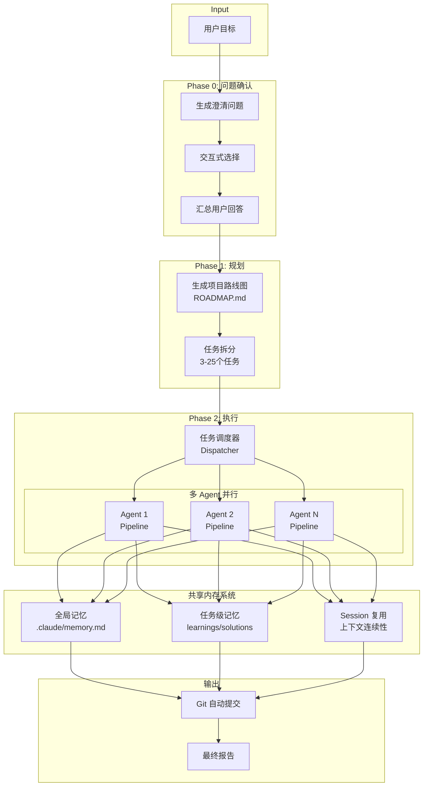
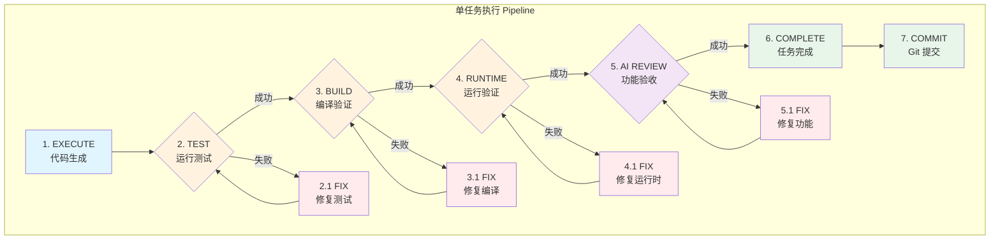
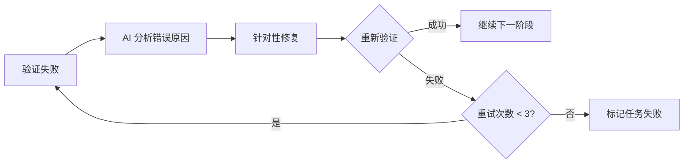
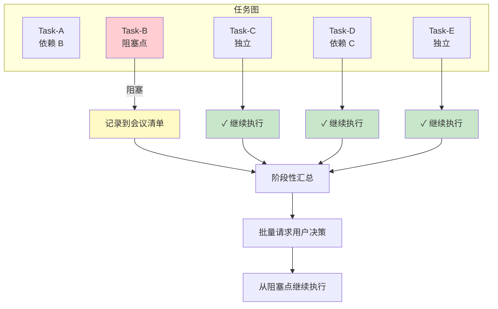
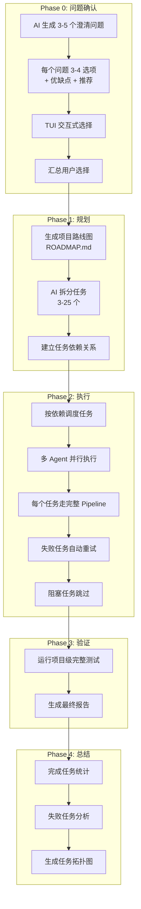
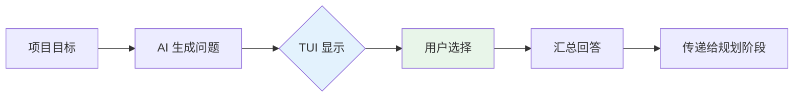
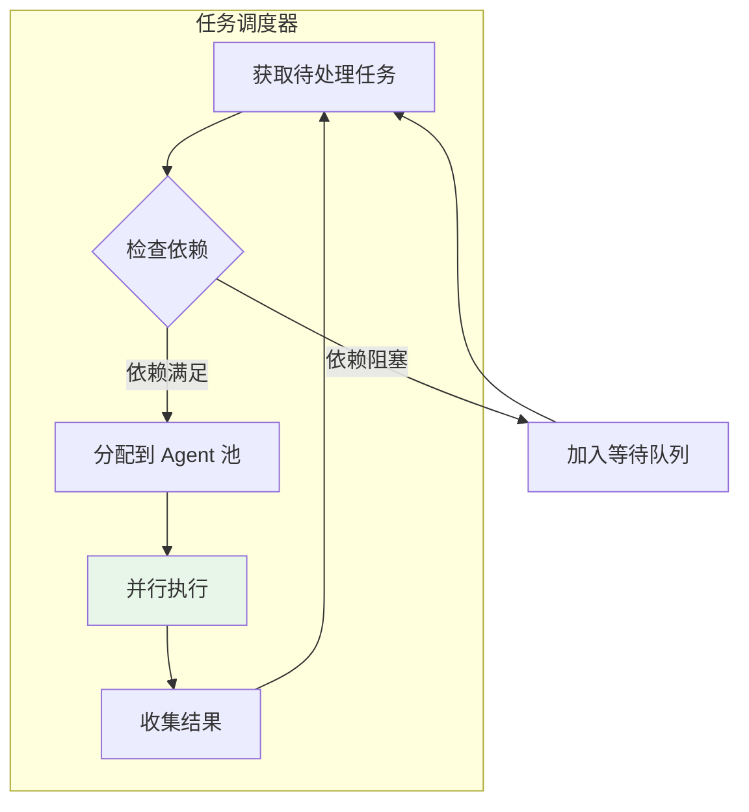

# Matrix

**真正的无人化项目构建系统** - 基于 Rust 和 Claude CLI 的自主软件开发编排器

> 给出一个目标，Matrix 将自动完成从需求澄清到代码交付的**全流程**，包含多阶段验证和自动修复机制

---

## 为什么选择 Matrix？

| 传统 AI 编程 | Matrix |
|-------------|--------|
| 生成代码就结束 | **7 阶段验证**，确保代码可运行 |
| 失败需要手动调试 | **自动修复**，测试/编译/运行时错误自动解决 |
| 遇到阻塞就停止 | **阻塞不中断**，记录问题继续执行其他任务 |
| 单线程顺序执行 | **多 Agent 并行**，效率最大化 |
| 无上下文记忆 | **Session 复用 + 共享内存**，知识跨任务传递 |
| 代码丢失风险 | **任务级 Git 提交**，每一步都有版本记录 |

---

## 核心架构



---

## 任务 Pipeline 详解

每个任务都经过 **7 阶段验证 + 自动修复**，确保生成的代码真正可运行：



### 自动修复机制

每个验证阶段失败后都会触发自动修复：



- **MAX_RETRIES = 3**：每个阶段最多重试 3 次
- **智能重试**：失败时保留错误上下文，下次执行时作为参考

---

## 阻塞问题处理机制

Matrix 的核心创新：**遇到决策阻塞不中断，继续执行可独立完成的任务**



**优势**：
- 最大化执行效率，不浪费等待时间
- 批量决策，减少用户被打断的次数
- 清晰的阻塞原因记录

---

## 完整执行流程



### Phase 0: 问题确认 (可选，默认开启)



**交互方式**：
- `↑↓` 导航选项
- `1-9` 快速选择
- `Enter` 确认
- `Esc` 跳过当前问题

### Phase 2: 任务调度



---

## 功能特性

| 特性 | 说明 |
|------|------|
| **7 阶段验证** | Execute → Test → Build → Runtime → AI Review → Complete → Commit |
| **自动修复** | 每阶段失败后 AI 自动分析并修复，最多重试 3 次 |
| **阻塞不中断** | 遇到决策点记录并继续执行独立任务，最大化效率 |
| **智能问题确认** | 交互式澄清需求，选择题 + 优缺点分析 + 推荐 |
| **多 Agent 并行** | 支持多个 Claude Agent 并行工作 |
| **任务依赖管理** | 自动建立依赖关系，按依赖调度执行 |
| **复杂任务拆分** | 递归拆分复杂任务，最多 5 层深度 |
| **Session 复用** | 保持上下文连续性，知识跨任务传递 |
| **共享内存系统** | 全局记忆 + 任务级记忆，经验累积 |
| **Git 自动化** | 启动初始化仓库 + 任务级自动提交 |
| **断点续传** | 支持从中断处恢复运行 |
| **多语言支持** | 支持中文/英文界面 |
| **交互式 TUI** | 实时终端界面：日志、任务状态、Claude 输出 |

---

## 安装

### 前置条件

- [Rust](https://rustup.rs/) 1.70+
- [Claude CLI](https://claude.ai/code) 已安装并认证
- [Task](https://taskfile.dev/)（可选，用于构建自动化）

### 快速安装

```bash
# 克隆仓库
git clone https://github.com/bigfish1913/matrix.git
cd matrix

# 用户级安装 (推荐，无需 sudo)
task install

# 系统级安装 (需要 sudo)
task install-system
```

或直接使用 cargo：

```bash
cargo build --release
cp target/release/matrix ~/.local/bin/
```

### 跨平台支持

| 平台 | 安装目录 | 备注 |
|------|---------|------|
| **macOS** | `~/.local/bin` | 支持 Intel & Apple Silicon |
| **Linux** | `~/.local/bin` | 自动检测架构 |
| **Windows** | `%USERPROFILE%\.local\bin` | PowerShell 安装 |

---

## 使用方法

```
matrix <目标> [路径] [选项]
```

### 参数

| 参数 | 说明 |
|------|------|
| `<目标>` | 项目目标描述 |
| `[路径]` | 输出路径（父目录或新目录） |

### 选项

| 选项 | 说明 |
|------|------|
| `--doc <文件>` | 规格/需求文档 |
| `-d, --workspace` | 指定工作区目录 |
| `--mcp-config <文件>` | MCP 配置 JSON（用于端到端测试） |
| `--resume` | 恢复上次运行 |
| `-n, --agents <N>` | 并行 Agent 数量（默认：1） |
| `--debug` | 实时输出 Claude 原始输出 |
| `-Q, --no-ask` | 跳过提问阶段（默认启用提问） |

### 示例

```bash
# 创建新项目（默认会提问澄清需求）
matrix "构建一个带用户认证的 REST API" ./my-api

# 跳过提问，直接开始
matrix "构建一个计算器应用" ./calc -Q

# 恢复中断的运行
matrix --resume

# 使用多个 Agent 并行运行
matrix "创建一个待办事项应用" ./todo -n 3

# 使用规格文档
matrix "实现这些功能" ./project --doc specs.md
```

---

## TUI 界面

### 标签页

| 标签 | 说明 |
|------|------|
| **Logs** | 实时日志追踪（INFO/WARN/ERROR），智能过滤重复内容 |
| **Tasks** | 任务列表（支持树形/列表视图），Enter 查看详情 |
| **Claude Output** | Claude 原始输出，支持 Markdown 渲染 |
| **Events** | 详细事件流（Verbose 模式调试用） |
| **Meeting** | 会议记录（阻塞问题汇总） |

### 快捷键

| 按键 | 操作 |
|------|------|
| `Tab` / `Shift+Tab` | 切换标签页 |
| `↑` / `↓` | 滚动内容 / 导航选项 |
| `Enter` | 查看任务详情 / 确认选择 |
| `1-9` | 快速选择选项 / 切换任务输出 |
| `a` | 查看所有任务输出 |
| `/` | 搜索任务 |
| `t` | 切换树形/列表视图 |
| `p` | 暂停/继续执行 |
| `v` / `V` | 切换详细程度 |
| `?` | 显示帮助 |
| `q` | 退出（有任务时需确认） |

### 状态栏

```
v1.0.0 Generating ⠋ | Task:00:05 | Total:02:15 | 5/12 | glm-5 | 3 agents | ?:Help q:Quit
       ↑        ↑           ↑              ↑       ↑        ↑
    状态版本  动画      当前任务时间    总时间   进度    模型   Agent数
```

---

## 架构

```
matrix/
├── Cargo.toml              # Workspace 根配置
├── crates/
│   ├── core/               # 共享编排逻辑
│   │   ├── agent/          # Claude 运行器 & Agent 池
│   │   │   ├── claude_runner.rs   # Claude CLI 调用
│   │   │   └── pool.rs            # Session 复用池
│   │   ├── executor/       # 任务执行器
│   │   │   └── task_executor.rs   # 7 阶段 Pipeline
│   │   ├── models/         # 数据结构
│   │   │   ├── task.rs            # 任务模型 (状态、依赖、记忆)
│   │   │   ├── question.rs        # 提问模型
│   │   │   └── manifest.rs        # 项目清单
│   │   ├── orchestrator/   # 主编排器
│   │   │   ├── orchestrator.rs    # 调度器 & 状态管理
│   │   │   ├── dependency_graph.rs # 任务依赖图 & 循环检测
│   │   │   ├── health_monitor.rs  # 阻塞任务健康监控
│   │   │   ├── task_scheduler.rs  # 任务调度 & 槽位池
│   │   │   └── prompts.rs         # AI 提示词模板
│   │   ├── store/          # 持久化
│   │   │   ├── task_store.rs      # 任务存储 (JSON)
│   │   │   └── question_store.rs  # 问题存储
│   │   ├── checkpoint/     # 进度检查点
│   │   ├── memory/         # 共享内存系统
│   │   ├── detector/       # 项目类型检测
│   │   │   ├── project.rs         # 语言/框架检测
│   │   │   └── test_runner.rs     # 测试运行器检测
│   │   └── tui/            # 终端 UI
│   │       ├── app.rs             # TUI 主循环
│   │       ├── render.rs          # 渲染逻辑
│   │       ├── event.rs           # 事件系统
│   │       └── components/        # UI 组件
│   └── cli/                # 命令行接口
│       └── main.rs
├── Taskfile.yml            # 构建自动化
└── docs/                   # 文档
```

### 编排器模块说明

| 模块 | 功能 |
|------|------|
| `orchestrator.rs` | 主调度器，协调所有阶段执行 |
| `dependency_graph.rs` | 任务依赖关系管理，循环依赖检测 |
| `health_monitor.rs` | 监控阻塞任务，生成会议清单 |
| `task_scheduler.rs` | 槽位池管理，任务并行调度 |
| `prompts.rs` | 集中管理 AI 提示词模板 |

---

## 配置

| 常量 | 默认值 | 说明 |
|------|--------|------|
| `MAX_DEPTH` | 5 | 最大任务拆分深度 |
| `MAX_RETRIES` | 3 | 每个验证阶段的重试次数 |
| `TIMEOUT_PLAN` | 120s | 规划/评估/验证超时 |
| `TIMEOUT_EXEC` | 3600s | 代码执行超时 |
| `MAX_PROMPT_LENGTH` | 80000 | 最大提示词长度 |

---

## 支持的项目类型

| 项目 | 标识文件 | 测试命令 | 安装命令 |
|------|----------|----------|----------|
| Rust | `Cargo.toml` | `cargo test` | `cargo build` |
| Node.js | `package.json` | `npm test` | `npm install` |
| Python | `pytest.ini`, `pyproject.toml` | `pytest -v` | `pip install` |
| Go | `go.mod` | `go test ./...` | `go mod download` |
| Makefile | `Makefile` | `make test` | - |

---

## 开发

```bash
# 构建
task build

# 运行测试
task test

# 运行 CLI
task run

# 格式化代码
task fmt

# 代码检查
task lint

# 构建发布版本
task release
```

---

## Git 提交格式

每个任务完成后自动生成结构化提交：

```
[task-001] 实现用户认证

Task ID: task-001
Title: 实现用户认证

Description:
  添加登录、注册、密码重置功能

Modified files (3):
  - src/auth/login.rs
  - src/auth/register.rs
  - src/models/user.rs

Result:
  实现了完整的用户认证系统，包含 JWT token 支持

Co-Authored-By: Matrix Orchestrator <matrix@agent.dev>
```

---

## 路线图

- [ ] Web 界面支持
- [ ] GUI 客户端
- [ ] Claude Code 插件
- [ ] 更多 LLM 后端支持
- [ ] 团队协作功能
- [ ] 云端任务队列

---

## 许可证

MIT
